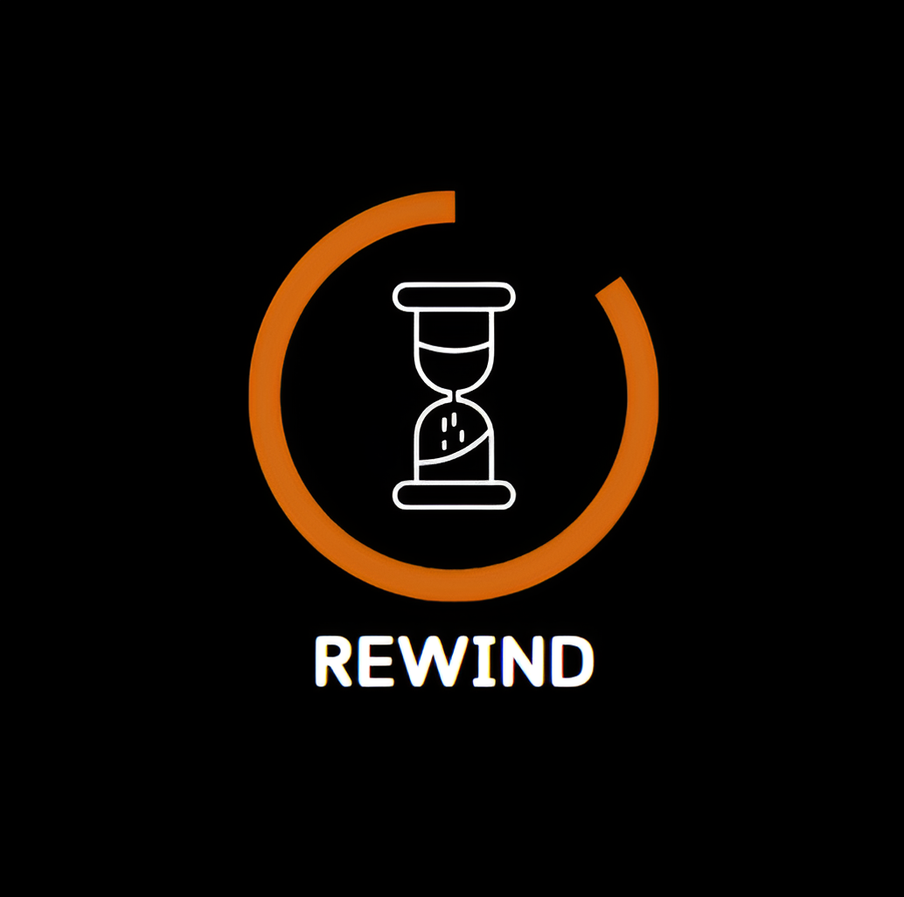

<h1 align="center">Rewind</h1>

<p align = "center">
  
</p>

<br>


## 📋 Description
  
Our console application offers users an engaging platform to explore and learn about the important events that have impacted the nation's history. The application is divided into different time periods, from ancient history to modern-day Bulgaria.

## 🚀 Languages 
  <p align="left"> 
  <a href="https://www.cplusplus.com/"></a>
 
  </p>

## 🔧 Tools 
  <p align="left"> 
  <a href="https://visualstudio.microsoft.com/"></a>
    <a href="https://www.microsoft.com/en-ww/microsoft-365/word"></a>
    <a href="https://www.microsoft.com/en-us/microsoft-365/powerpoint">
    <a href="https://git-scm.com/"></a>
    <a href="https://git-scm.com/"></a>
    <a href="https://www.microsoft.com/bg-bg/microsoft-teams/group-chat-software?ms.url=teamscom"></a>
  </p> 
  
## 💼 Documents
  <ul>
    <li><a href="documentation/REWIND-documentation.docx">Documentation</a></li>
    <li><a href="documentation/REWIND-presentation.pptx">Presentation</a></li>
    <li><a href="documentation/REWIND-QA-Documentation.xlsx">QA Documentation</a></li>
   </ul>


## 🔧 Installation

```
You can download our project by using the green "Code" button.

Or by pasting the following code in your CMD:
git clone https://github.com/codingburgas/linked-list-sprint-project-rewind.git
```

## ⚙ Website Access

*You can access our website by pasting this link into your browser.*
```
  https://github.com/codingburgas/linked-list-sprint-project-rewind.git
```

## 🖥 Team Members
* **Hristo Rusev** - *Scrum trainer* 
* **Ivan-Mihail Ivanov** - *Back-end developer* 
* **Martin Dimitrov** - *Front-end developer* 
* **Petur Dimitrov** - *Q&A Engineer*


 
